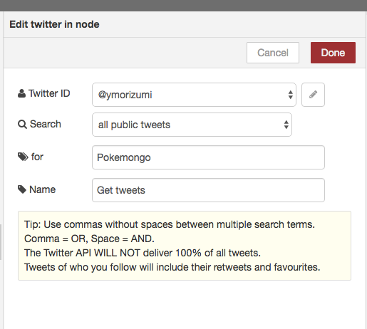

# Civic Tech@東海 Bluemix ハンズオン

ながれ
 - [事前準備](## 事前準備)
 - [作成するアプリ](## 作成するアプリ)
 - [ IoT Platform Starterをデプロイする](## IoT Platform Starterをデプロイする)
 - [Worldmapのノードを用意する](## Worldmapのノードを用意する)
 - [フローの作成](## フローの作成)
 - [動作確認](## 動作確認)
 - [参考URL](## 参考URL)

## 事前準備

### API Keyの取得
以下のリンクよりGoogle MapsのAPI Keyを取得してください。

https://code.google.com/apis/console


新規プロジェクトを作成します。

### Google Static Maps APIを有効化
Google Static Maps APIを選択します。


Google Static Maps APIキーが生成されます。


### APIキーが有効か確認する
ブラウザに以下のURLを入力し、 Google Static Maps APIキーが有効であることを確認します。
https://maps.googleapis.com/maps/api/staticmap?center=Fukuoka &size=800x400&sensor=false&key=xxxxxxxxx（取得したAPIキー）


## 作成するアプリ

### Node-REDで位置情報付きツイートを地図上に表示させる
Worldmapノードを使いNode-REDで位置情報付きツイートを地図上に表示させるア プリを開発します。Worldmapノード等のユーザー・インターフェスを取り扱うノードを使えば、HTMLで作成する必要がありません。


### 全体フロー
Node-REDで作っていきます。


## IoT Platform Starterをデプロイする
Bluemixにログイン後、モノのインターネットを選択。


右上のプラスボタンをクリック。


左側のメニューのボイラーテンプレートをクリック。


右側のアイコンからInternet of Things starterをクリック。


アプリケーション名を入れる。この時、自動的にホスト名が入りますので、アプリケーション名は必ず他人と被らないような名前にする。


ページ下部にある作成ボタンをクリックする。


しばらくすると"アプリは実行中です"というステータスに変わるので、アプリの表示をクリックする。


Node-REDの完成です！赤いボタンをクリックするとパレットの画面に変わります。


## Worldmapのノードを用意する
Bluemixの画面に戻り、上のタブのメニューから概要をクリック。
アプリケーションの概要が表示されるのでページ下部にある"Gitリポジトリーとパイプラインの作成"をクリックする。


ポップ画面でそのまま"試行"をクリックするとGitリポジトリーが作成されます。
続いてコードの編集をクリックする。


Web IDEが開きますので、左側のメニュー鉛筆マークをクリックするとソースコードが表示されるのでpackage.jsonをクリック。


19行目に以下のようにnode-red-contrib-web-worldmapを追加してください。

```Javascript
{
    "name"         : "iot-bluemix",
    "version"      : "0.4.20",
    "dependencies": {
        "when": "~3.x",
        "mongodb": "~1.4.x",
        "nano": "~5.11.0",
        "cfenv":"~1.0.0",
        "feedparser":"~0.19.2",
        "redis":"~0.10.1",
        "node-red": "0.x",
        "node-red-bluemix-nodes":"1.x",
        "node-red-node-watson":"0.x",
        "node-red-node-openwhisk":"0.x",
        "node-red-node-cf-cloudant":"0.x",
        "node-red-contrib-scx-ibmiotapp":"0.x",
        "node-red-contrib-ibmpush":"0.x",
        "node-red-contrib-bluemix-hdfs":"0.x",
        "node-red-contrib-web-worldmap":"0.x", //←追加行
        "node-red-nodes-cf-sqldb-dashdb":"0.x"
    },
    "engines": {
        "node": "0.12.x"
    }
}

```

左側のメニューのGitマークをクリックする。


編集内容をコミットしプッシュする。以下の流れで実施する。
①コミットメッセージを入れ、②コミットをクリック、③プッシュをクリック


BUILD & DEPLOYをクリック。


BUILDとDEPLOYが成功しているとステージの成功という表記とともに、最終実行結果が返ってきているのでURLをクリック。


Node-REDを開いてみると、locationのメニューにworldmapが追加されていることを確認してください。


## フローの作成
Node-RED Editorをオープンして、あらかじめ登録されているサンプル・フロー( Flow 1)とは別パレットに新規フロー(Flow 2)を作成します。


あらためて全体のフローを確認。左側のノードパレットからキャンバスにドラッグ・アンド・ドロップしてください。


### ①Twitter
ツイート情報を集集するノードを準備します。「twitter」ノード をダブルクリックして次のようにプロパティを設定をする。
 - Twitter ID: 自身のTwitterのID(認証連携済み)
 - Search: all public tweets (すべての世の中のつぶやき)を選択
 - for: 取得したいキーワード(ここでは、Pokemongo)
 - Name: ノード名 (ここでは、Get tweets)


### (補足)Twitter Credential情報の追加方法
Twitterノードを追加して、Credential情報を追加します。Twitterアカウントとの連携が正常に完了すると” Authorised - you can close this window and return to Node-RED”と表示されます。Twitter IDを確認してAddをクリックしてください。


### ②Switchノード
ツイートをチェックするノードを準備します。Location情報が含まれるツイートのみ「1」に進みます。


### ③Switchノード
ツイートをチェックするノードを準備します。Lat(latitude: 緯度)情報が含まれるツイートのみ「1」に進みます。


### ④Switchノード
ツイートをチェックするノードを準備します。Lon(longitude: 緯度)情報が含まれるツイートのみ「1」に進みます。


### ⑤Functionノード
Functionノードを準備します。WebSocketノードへ、移動先の緯度経度を含むJSONデータを送るだけで、地図の中心が移動できます。同時にzoomの値を変えることで拡大縮小てきます。layerの値を変えることで表示する地図も変更できます。

```Javascript
msg.payload = {
  command:{
    layer:"Esri Terrain",
    lat: msg.location.lat,
    lon: msg.location.lon,
    zoom:3
  }
};
return msg;
```


### ⑥Functionノード
WebSocketノードに、緯度経度を含むJSONデータを送るだけでブラウザ上にピンを配置できます。ここではTwitterノードから取得した緯度 lat、経度lonの値をmsg.payloadのJSONデータに代入しています。iconやiconColorでピンの種類を設定てきます。

```Javascript
var output = {
  lat: msg.location.lat,
  lon: msg.location.lon,
  place: msg.location.place,
  tweet: msg.payload,
  name: msg.tweet.user.name,
  icon: "globe",
  iconColor: "orange"
};
msg.payload = output;
return msg;
```


### ⑦Websocket outノート
゙worldmapノードが表示したブラウザにWebSocket経由で地図操作処理を送るため、 WebSocketノードを配置します。WebSocketノードに設定するURLは/ws/worldmapです。


pathの右にある鉛筆マークでPathを設定する。


### ⑧Worldmapノード
Node-REDの開発画面の左側のパレットから、worldmapノードをフロー画面に配置するのみで、地図を表示するURL(http://<アプリ名>.mybluemix.net/worldmap)にア クセスできる様になる。


### フローをつなげる
出来上がった各ノードをつなげて、右上のDepoyをクリックすれば完成です!エラーが 出ていないことを確認してください。


## 動作確認
地図を表示するURL(http://<アプリ名>.mybluemix.net/worldmap)にアクセスし、位置情報付きツイートが地図上に表示させることを確認してください。


## 参考URL
 - [1分で実装!Node-REDでREST API呼び出し](http://qiita.com/zuhito/items/ed5f505edaac2baeadd9)

 - [GoogleMaps APIより簡単!Node-REDで位置情報付きツイートを地図上に表示](http://qiita.com/zuhito/items/2625c85d35f6289f118b)

 - [Google Static Maps APIの使い方まとめ!画像地図を作ろう](https://syncer.jp/how-to-use-google-static-maps-api)

 - [Google Maps APIの基本](http://www.ajaxtower.jp/googlemaps/charset/index1.html)

 - [Node-REDでTwitterデータ取得・表示](https://syncer.jp/how-to-use-google-static-maps-api)
